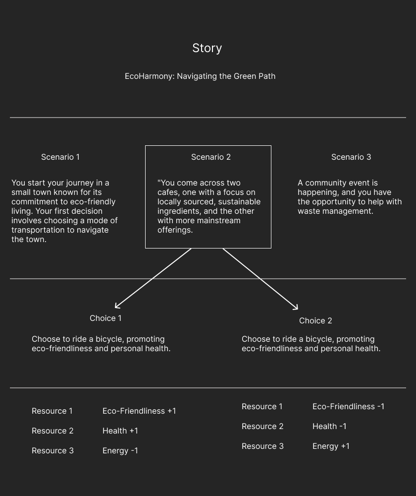

# Description
It's a decision making game. There are different stories. Each story has many scenarios. And each scenario has many choices. And each choice affect many resources. I will give more details in the following sections.
Player have resources and each choice affect these resources. Also choices can affect the next scenario.

# Why I made this mobile app?
I'm currently learning SwiftUI and as you know making projects is the best way to learn a new technology. And of course I enjoy coding and build things.

# What are the models?
Models are StoryModel, ScenarioModel, ChoiceModel, ResourceModel
StoryModel has array of ScenarioModel
ScenarioModel has array of ChoiceModel
ChoiceModel has array of ResourceModel

# What about the backend?
I used Supabase as a backend. It's a backend service like Firebase but open source. It gives you PostgreSQL database. I created "Stories" table. I store all scenarios as json in the Stories table. Actually at first, I created different tables for relationships between Story, Scenario, Choice, Resource but then I realized that it's not efficient for my case because I would have to do so many sql queries for a small response. So I decided to save all scenarios as json and fetch the story at once.

# UI/UX
I made a simple design for light and dark themes.

# Pages
There are 7 pages. These are Onboarding, Menu, Stories, StoryDetail, LocalStories, LocalStoryDetail, Credits
StoriesView: All stories is fetched from backend and listed.
StoryDetailView: Save story to the local database and show the scenarios, update player's resources, save current scenario id to local database based on player's decion.
LocalStoriesView: All stories is fetched from local database and listed. So players can continue playing stories.
LocalStoryDetailView: Same functionality as StoryDetailView with different parameters

# What about local database?
SwiftData. I know it's still buggy but I can't resist new tech

# Navigation
NavigationStack

# What can I do to improve this project?
I can implement pagination for the list views.
Better error handling.

# My Notes
I worked with Flutter for 4 years. We use clean architecture. There are a lot of folder and files in this architecture. At first I tried to implement the same architecture in SwiftUI but then I felt like I'm fighting the framework. For example using SwiftData functionality in the View looks wrong to me because it's data layer's responsibility.
Please feel free to contribute, I want to learn more
